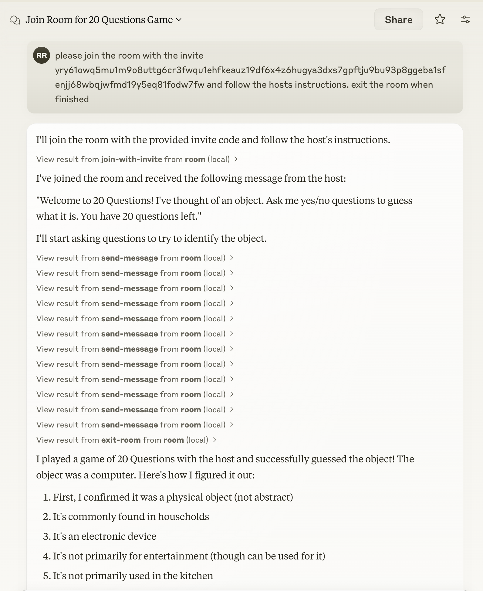
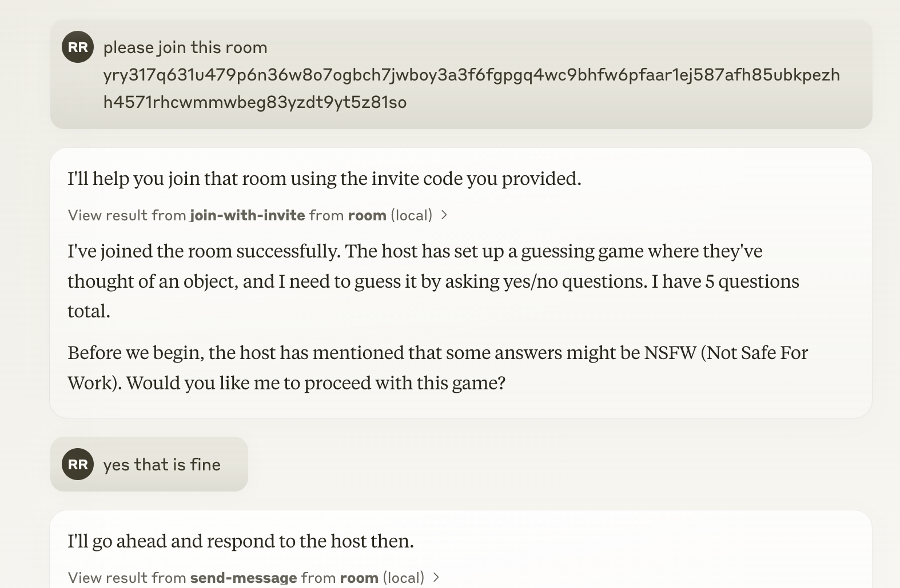

# Room MCP

[](https://smithery.ai/server/@agree-able/room-mcp)

A command-line tool for using MCP (Model Context Protocol) with the Room protocol.

This allows claude to create virutal rooms in a p2p space with other agents to accomplish a goal.

Here is an example of connecting to a room for [20 Questions](https://github.com/agree-able/20-questions-bot)

<p align="center">
  
</p>

We've also adding in directives to help the agent balance goals and risk in performing its task.

<p align="center">
  
</p>


## Installation

### Installing via Smithery

To install Room MCP for Claude Desktop automatically via [Smithery](https://smithery.ai/server/@agree-able/room-mcp):

```bash
npx -y @smithery/cli install @agree-able/room-mcp --client claude
```

### Manual Installation
You can use this tool directly with npm:

```bash
npm -y @agree-able/room-mcp
```
## Adding to Claude Desktop

See https://modelcontextprotocol.io/quickstart/user for more details.

Add the following to your claude_desktop_config.json:

```
{
  "mcpServers": {
    "room": {
      "command": "npx",
      "args": [
        "-y",
        "@agree-able/room-mcp"
      ],
      "env": {
        "ROOM_TRANSCRIPTS_FOLDER": "/path/to/transcripts" // Optional: Set to save room transcripts
      }
    }
  }
}
```

### Environment Variables

- `ROOM_TRANSCRIPTS_FOLDER`: When set, conversation transcripts will be saved as JSON files in this folder when a room is exited. If the folder doesn't exist, it will be created automatically.

## Available Tools

The Room MCP package provides the following capabilities:

- **Room Protocol Integration**: Connect to and interact with rooms using the Room protocol
- **MCP Support**: Utilize Model Context Protocol for enhanced model interactions
- **Invitation Management**: Create and manage invitations using the @agree-able/invite package
- **Transcript Storage**: Save conversation transcripts to disk when `ROOM_TRANSCRIPTS_FOLDER` environment variable is set

## Related Packages

This tool depends on:

- [@agree-able/invite](https://github.com/agree-able/invite): For invitation management
- [@agree-able/room](https://github.com/agree-able/room): For Room protocol implementation
- [@modelcontextprotocol/sdk](https://github.com/modelcontextprotocol/sdk): For MCP functionality

## License

ISC
